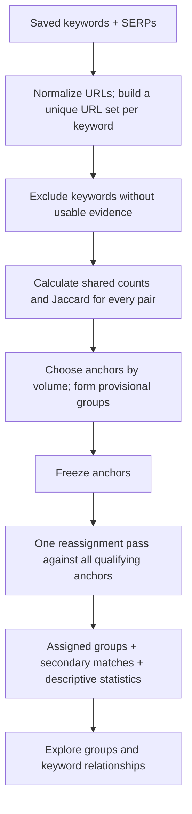

# clustering-algo-poc

A local Python experiment for grouping keywords by the **organic search-result URLs they share**.

Explore saved search results, inspect individual relationships, and compare deterministic anchor groups in a Streamlit app. Everything in the explorer runs from local JSON files.

> **Experimental:** Groups describe overlap in saved search results. They are not validated SEO topics, page recommendations, or semantic labels.

[Quick start](#quick-start) · [Algorithm](#how-the-clustering-works) · [Explorer](#using-the-explorer) · [Code map](#code-map) · [Collection](#collecting-serps-optional)

## Quick start

Python **3.11+** is required. To start from a fresh checkout:

```bash
git clone https://github.com/Determine06/clustering-algo-poc.git
cd clustering-algo-poc
python3.11 -m venv .venv
source .venv/bin/activate
python -m pip install -r requirements.txt
streamlit run app.py
```

For an existing checkout, run the environment and launch commands from its current directory. On Windows, activate with `.venv\Scripts\Activate.ps1`.

**No API credentials are needed to explore the saved data.** The browser UI reads the repository's keyword and SERP files; it does not collect new results.

## How the clustering works

A **SERP** is a search-engine results page. An **anchor** is a keyword chosen to represent a group. Its saved URLs are the reference for membership; anchors are never replaced by centroids or generated labels.



### 1. Build the evidence

The keyword list defines the analysis scope. For each keyword, the code orders saved results by rank, takes up to 10, and builds a **set of unique usable normalized URLs**.

| Normalize | Preserve |
| --- | --- |
| Lowercase scheme and hostname | Path case, trailing slash, and `www` |
| Remove fragments (`#section`) | The distinction between `http` and `https` |
| Remove `utm_*`, `gclid`, `fbclid`, `msclkid`, `srsltid` | Other query parameters, including YouTube's `v` |
| Deduplicate normalized URLs for comparison | Original URLs, ranks, and titles for inspection |

No redirects are fetched. Keywords with missing or empty usable SERPs are excluded and reported separately: **missing evidence is not zero overlap**.

### 2. Calculate two different measures

For URL sets **A** and **B**:

| Measure | Formula | Role |
| --- | --- | --- |
| Shared URL count | Size of the intersection: `len(A & B)` | Determines whether an anchor qualifies |
| Jaccard similarity | `len(A & B) / len(A \| B)` | Chooses the best qualifying anchor |

Jaccard uses actual set sizes, not an assumed denominator of 10. For example, two sets with 6 and 8 URLs sharing 3 have a union of 11 URLs and Jaccard **3/11 ≈ 27.3%**.

Ranks select the top results; they do not weight overlap. Search volume affects anchor priority and tie-breaking; it does not weight similarity. All unordered eligible keyword pairs remain available, including zero-overlap and cross-group pairs.

### 3. Choose anchors deterministically

**Minimum shared URLs** is an integer from **1–10**, default **3**. It is an experimental setting.

1. Sort eligible keywords by descending search volume. Missing volumes come last, including after zero. Break ties alphabetically.
2. Take the first unassigned keyword as the next anchor.
3. Provisionally assign every remaining unassigned keyword sharing at least the minimum number of URLs **directly with that anchor**.
4. Repeat until every eligible keyword has a provisional group.

Alphabetical comparisons are case-insensitive, with the original spelling as the final tie-break. The same inputs and threshold produce the same anchors and assignments.

A chain does not qualify a keyword: if A overlaps B and B overlaps C, C cannot join A's group unless C itself meets the threshold against A.

### 4. Freeze anchors and reassign once

Every anchor stays in its own group. For each **non-anchor** keyword:

1. Compare it against **all** chosen anchors.
2. Keep only anchors meeting the shared-URL minimum.
3. Assign it to the anchor with the highest Jaccard similarity.
4. Break a similarity tie by higher anchor volume, then alphabetically; missing volume remains last.

This is **one reassignment pass**. There is no repeated anchor update, iterative optimization, or connected-component clustering. A keyword without a qualifying relationship becomes its own anchor. A group can also become a singleton when its provisional members move elsewhere.

#### Worked example

Synthetic URL identifiers below stand for distinct normalized URLs. Set the minimum to **3**.

| Keyword | Volume | URL set |
| --- | ---: | --- |
| Anchor A | 1,000 | a, b, c, d, e, f |
| Anchor B | 800 | g, h, i, j |
| Keyword X | 100 | a, b, c, g, h, i |

A is chosen first and provisionally takes X. B shares no URLs with A, so B becomes a second anchor.

| X compared with | Shared URLs | Jaccard | Qualifies? |
| --- | ---: | ---: | --- |
| A | 3 | 3/9 = 33.3% | Yes |
| B | 3 | 3/7 = 42.9% | Yes |

In the single reassignment pass, **X moves to B** because B has the higher Jaccard. A and B remain fixed anchors. A is now a singleton.

### 5. Preserve secondary relationships

Each non-anchor retains its best and second-best qualifying anchors, with their similarity scores.

**Ambiguous** means the two Jaccard scores differ by **at most 0.05** (five percentage points). This is a score-gap heuristic, **not a confidence probability**. A keyword with only one qualifying anchor is not marked ambiguous. Anchors remain fixed and are not assigned alternatives.

Groups also include two descriptive statistics:

- Average Jaccard across every unique member pair.
- Percentage of member pairs with zero shared URLs.

These include the anchor, exclude self-comparisons, and show **N/A for singletons**. Members can overlap the same anchor while sharing no URLs with each other. The statistics reveal that pattern; they do not split groups. Anchor rows in the member table show self-overlap as 100% Jaccard.

## Using the explorer

The overview shows keyword count, SERP coverage, a literal keyword search, and a volume histogram. Null volumes stay missing and are omitted from the histogram.

| Tab | What it shows |
| --- | --- |
| **Heatmap** | Alphabetical keyword pairs colored by shared count or Jaccard; subset selection, hover details, hidden diagonal |
| **Relationship Graph** | Anchor groups and keyword connections in the two views below |
| **Keyword Inspector** | Top 20 positive-overlap neighbors, any eligible pair comparison, shared URLs, and ranking lists |
| **Distribution** | All unique pairs by shared count, percentage with any overlap, and saved-result counts |

### Two graph views

**Group view** is the default. Each group has a separate labeled area, a diamond anchor at its center, and members around it. Anchor-member links are always drawn. Scroll through the areas; positions and spacing serve readability, not similarity measurement.

**Relationship view** uses a seeded, Jaccard-weighted NetworkX spring layout. Colors still represent assigned anchor groups. Connected islands and graph distances do not determine membership.

In either view, select a **Group anchor** to highlight its members and inspect its table and statistics. Other groups dim; connections touching the selected group are emphasized. Choose **All groups** to clear selection.

### Membership versus display controls

| Control | Default | Changes membership? | Effect |
| --- | --- | :---: | --- |
| Minimum shared URLs | 3 | **Yes** | Recomputes anchors and the single reassignment pass |
| Strongest neighbors | 5 | No | Draws the union of each keyword's top 1–10 positive neighbors by Jaccard; alphabetical ties |
| All nonzero edges | Off | No | Uses every positive-overlap pair instead of the neighbor filter |
| Hide singleton groups | On in Group view | No | Hides groups of exactly one keyword, even if they connect to other groups |
| Show cross-group connections | Off in Group view | No | Adds actual cross-group keyword edges under the existing edge filter |
| Group selection / keyword highlight | All groups / None | No | Changes highlighting and inspection |

Group view always retains anchor-member links regardless of the neighbor filter. Its cross-group links are faint unless emphasized by selection.

The four summary counts—**groups with 2+ keywords**, **keywords in those groups**, **singleton keywords**, and **ambiguous keywords**—always use the full clustering output. Separate visible counts reflect display filtering.

## Code map

The stack is Python, Streamlit, pandas, Plotly, and NetworkX. Data stays in JSON files; there is no database server or backend API.

| File | Responsibility |
| --- | --- |
| [app.py](app.py) | Overview, four explorer tabs, controls, and Streamlit caches |
| [topical_map/storage.py](topical_map/storage.py) | Repository-relative JSON paths, loading, and atomic saving |
| [topical_map/overlap.py](topical_map/overlap.py) | URL normalization, usable evidence, all pair metrics, and edge selection |
| [topical_map/clustering.py](topical_map/clustering.py) | Pure anchor selection, one-pass reassignment, secondary matches, and group statistics |
| [topical_map/visuals.py](topical_map/visuals.py) | Plotly figures, seeded relationship layout, and deterministic group layout |
| [topical_map/serps.py](topical_map/serps.py) | Optional concurrent DataForSEO collector |
| [tests/](tests/) | Synthetic overlap/clustering fixtures, layout checks, and mocked collector tests |

Overlap and clustering caches depend on loaded data; clustering also depends on the minimum shared-URL setting. Graph layouts are cached separately. Display-only changes do not rerun clustering. Pairwise analysis stores all `n × (n − 1) / 2` comparisons, so computation and memory grow quadratically with the number of eligible keywords.

### Data files

| Path | Contents |
| --- | --- |
| `database/keyword_list.json` | Array of `{keyword, search_volume}`; volume may be `null` |
| `database/serp_data.json` | Array of `{keyword, fetched_at, results}`; each result has `rank`, `url`, and `title` |

Paths resolve relative to the repository, not the shell's working directory. The explorer reads these files without rewriting them. Group assignments are calculated in memory rather than saved back into the source data.

## Collecting SERPs (optional)

Skip this section to use the existing saved results. Running the collector sends requests to your DataForSEO account.

1. Install dependencies with `python -m pip install -r requirements.txt`.
2. If `.env` does not already exist, copy `.env.example` to `.env` in the repository root.
3. Enter the API login and password from DataForSEO API Access:

   ```dotenv
   DATAFORSEO_LOGIN=your_api_login
   DATAFORSEO_PASSWORD=your_api_password
   ```

4. Try up to five missing keywords:

   ```bash
   python -m topical_map.serps update --limit 5
   ```

5. Collect the remaining missing keywords:

   ```bash
   python -m topical_map.serps update --workers 10
   ```

The collector uses Google organic Live Advanced results for the US, English, desktop/Windows, depth 10. It retains organic items in rank order, up to 10, and preserves their original URLs.

It skips saved keywords, submits at most the worker count concurrently, and atomically saves each success on the main thread. The timeout is 120 seconds; `--workers 1` runs sequentially. Ordinary failures remain unsaved for a later run. Fatal authentication/account/balance errors or Ctrl+C stop new submissions and drain in-flight work. HTTP errors and DataForSEO task codes are classified separately: task `40101` is a per-keyword search-engine error.

`.env` is ignored by Git. Existing environment variables take precedence over values loaded from that file.

## Verification

```bash
python -m unittest discover -s tests -v
```

Tests cover URL normalization, unequal URL-set sizes, missing evidence, direct-anchor qualification, reassignment, deterministic ties, fixed anchors, singletons, ambiguity, group statistics, display filtering, and mocked collector behavior. No paid requests are needed to run them.
